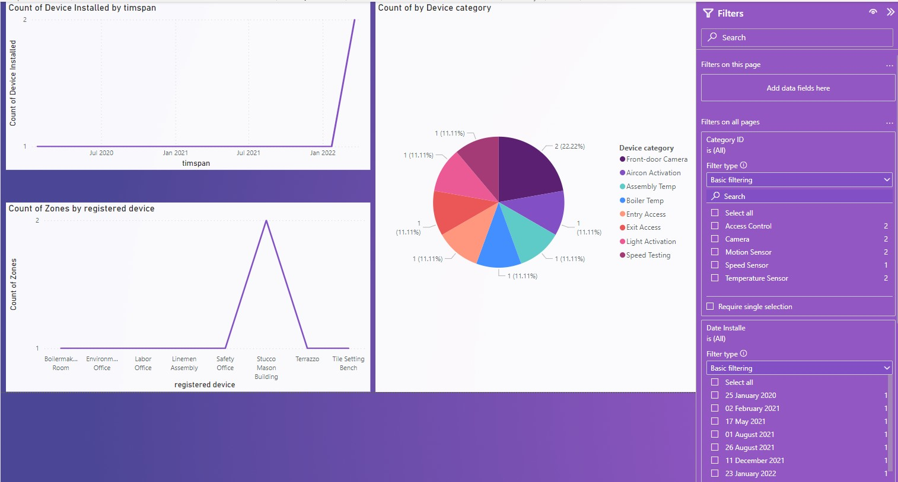

<h1>How to use the IOT report</h1>
<h1>Start</h1>

<h2>High-Level Metrics</h2>

First, the user is met with the High-Level Metrics page, where they will have a general overview of the full report data; the number of zones, categories, and devices are produced on this page; they can also use the slices, which are in the form of dropdowns, to change the form of the data to produce more insight.

The register button will take the user to the form below where the user can fill in there form information

<h2>Device Monitoring</h2>

The user will be meat by visuals that monitor devices per category,monitor devices per zone,monitor online versus offline
devices (status should depict
whether a device is online or offline)

<h2>Device Registration</h2>

The user will be meat by visuals that allows the user
to see how many devices have been
registered over a timespan,allows the user
to see how many categories of
devices have been created,t allows the user
to see how many zones contain
registered devices on a timeline 
